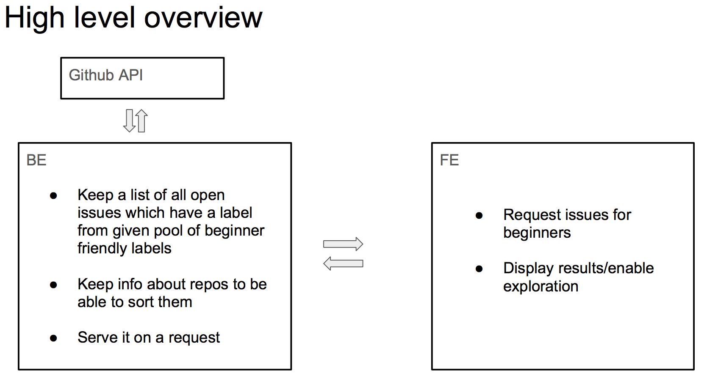

# berlin-issues-explorer-be

Backend part for **issues-explorer** project.
 

## issues-explorer

 **issues-explorer** project aims to make it easier to discover opensource project issues which are suitable for beginners.

There are a lot of opensource projects whose contributors apart from wanting to get new contributors, also want to support people to step into opensource community by providing clean guidelines on how to contribute, insisting on precise issue descriptions and labeling issues suitable for beginners by one of the following labels: `first-timers-only, up-for-grabs, newcomer, jump-in` etc.
  
**issues-explorer** project displays up to date overview of those issues allowing for filtering/grouping by programming language or other repository tags. In the next phase project should also be able to display info how much activity is happening in each repository and option to sort by most/least active ones.

# Motivation

Improve our technical and collaboration skills by developing an open-source web-application together during Women Who Code hack nights.
With this, we want to provide learning playground for Hack Evening participants who are interested in chosen technology stack. We want to make this project yours as well. Don't be shy to take ownership of parts of it :)

#

## Contributing

Please review our [contributing guidelines](CONTRIBUTING.md) and enjoy collaboration! 

## Setup development environment
  
In order to have development environment ready so that you can start contributing follow steps in one of two listed options:
  
  1) Run and build project locally
    * java8 is installed
    * gradle (build tool) is installed
    * your favorite IDE is installed (intellij/eclipse)
    * gradle plugin for IDE is installed

  2) Use cloud IDE preconfigured for this project (up and running in few minutes)
    * Paste the following url in your browser and create free user account for codenvy.io
    * Connect your github account 

## Implementation

Data about github repositories of opensource projects and currently open issues which contain one of the labels from preconfigured list is fetched from github through github REST api and stored in relational database.

Link to GitHub API: https://developer.github.com/v3/
GitHub Wrapper for JAVA: https://github.com/eclipse/egit-github/tree/master/org.eclipse.egit.github.core

REST api then serves information about issues. Additionally, data stored in database can be used for further analysis about activities in stored repositories (how active beginners are in given repo = how many issues with given set of labels were closed in the last X days, etc.) 

## Tests

Run `gradle test` to run all tests in the project.
